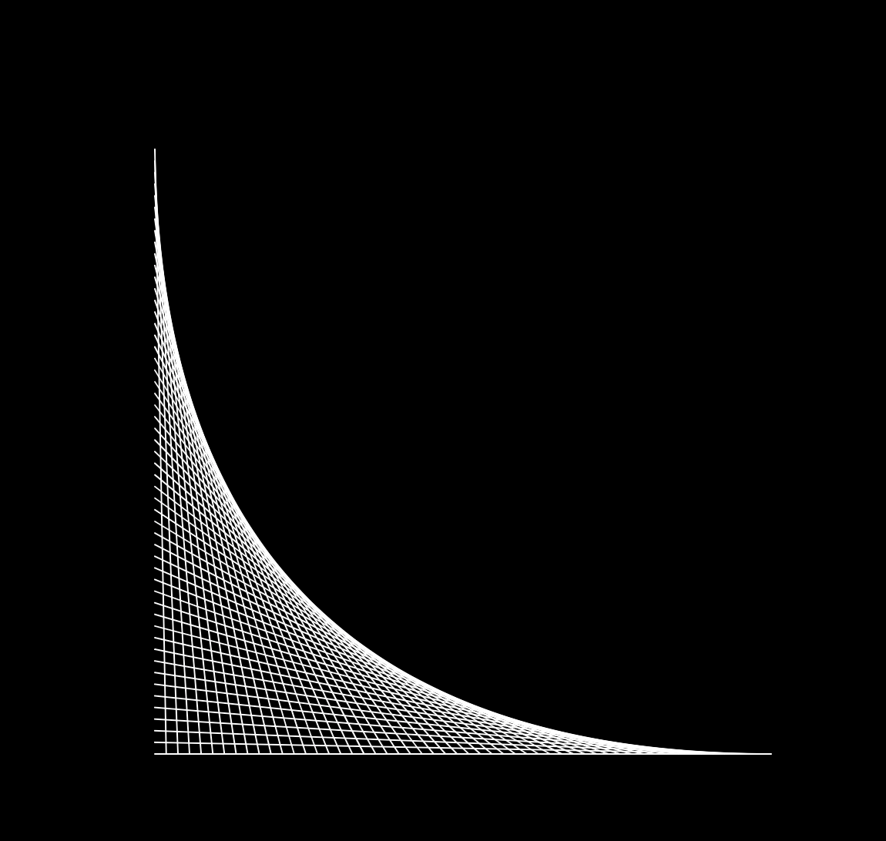
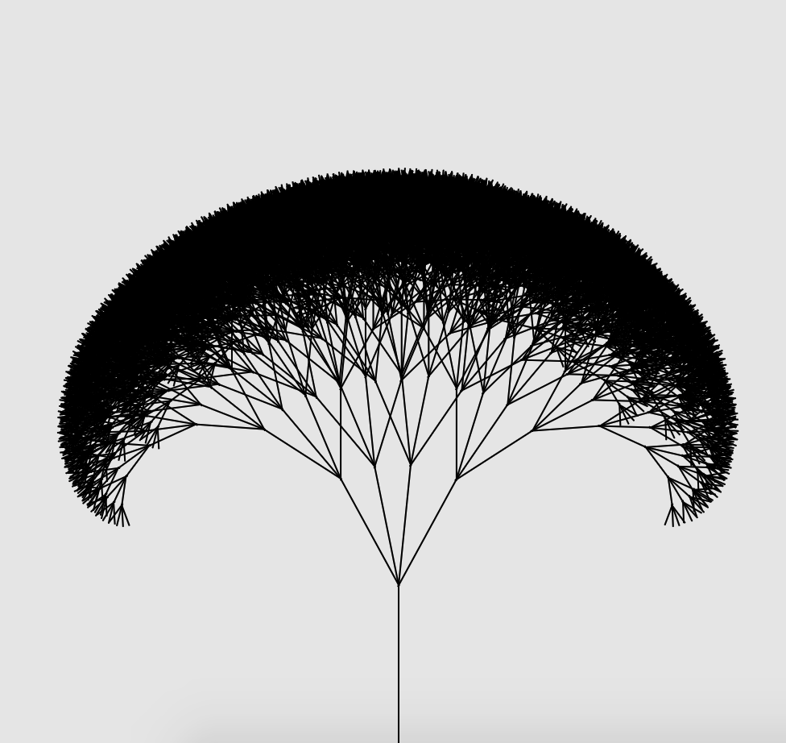
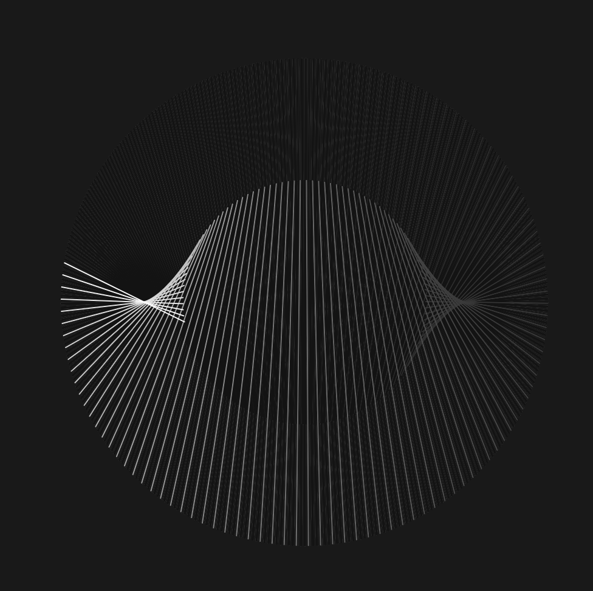
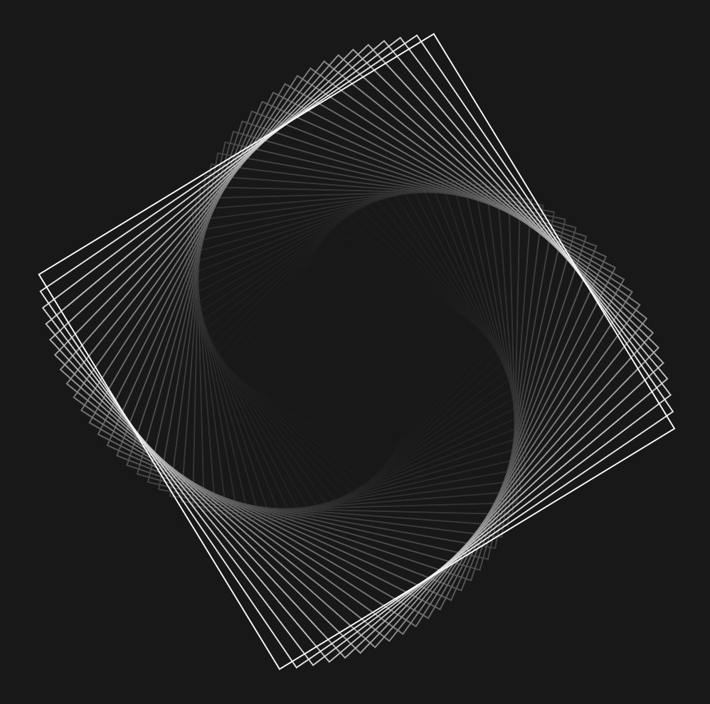

<head>
  
<link rel="stylesheet" href="https://www.w3schools.com/w3css/4/w3.css">
<link rel="stylesheet" href="https://fonts.googleapis.com/css?family=Karma">

  </head>

<body>

<!-- main content -->
<h4> By Joel Hurst.</h4>

All of my sketches are written in Processing then <strong>pain</strong>stakingly(2d arrays) adapted into p5.js! :) (almost all sketches are animated but obvs not on these images).

<!-- first row -->

  

    

      
      <h3><a href="https://venomswitch.github.io/sketchbook/angleSketch/">Angle</a></h3>
      
I used to draw these in primary school so thought it would be interesting to recreate it in Processing.

    

    

      
      <h3><a href="https://venomswitch.github.io/sketchbook/fractalTree/">Fractal tree</a></h3>
      
Basic fractal tree with 4 branches at equal angles per iteration.

    

    

      
      <h3><a href="https://venomswitch.github.io/sketchbook/parametricP5/">Parametric equations</a></h3>
      
Parametric equations made basic here for purpose of reliability. Can be a bit mental with random values/colours.

    

    

      
      <h3><a href="https://venomswitch.github.io/sketchbook/swirlingRectp5">Swirling rectangles</a></h3>
      
Made by mistake, ended up with this cool pattern.

    

  

  
  

<!-- second row -->

  

    

      

      
      

        
John Doe

      

      

      <h3><a href="https://venomswitch.github.io/sketchbook/angleSketch/">Angle</a></h3>
      
I used to draw these in primary school so thought it would be interesting to recreate it in Processing.

    

    

      
      <h3><a href="https://venomswitch.github.io/sketchbook/fractalTree/">Fractal tree</a></h3>
      
Basic fractal tree with 4 branches at equal angles per iteration.

    

    

      
      <h3><a href="https://venomswitch.github.io/sketchbook/parametricP5/">Parametric equations</a></h3>
      
Parametric equations made basic here for purpose of reliability. Can be a bit mental with random values/colours.

    

    

      
      <h3><a href="https://venomswitch.github.io/sketchbook/swirlingRectp5">Swirling rectangles</a></h3>
      
Made by mistake, ended up with this cool pattern.

    

  

  
  

</body>
