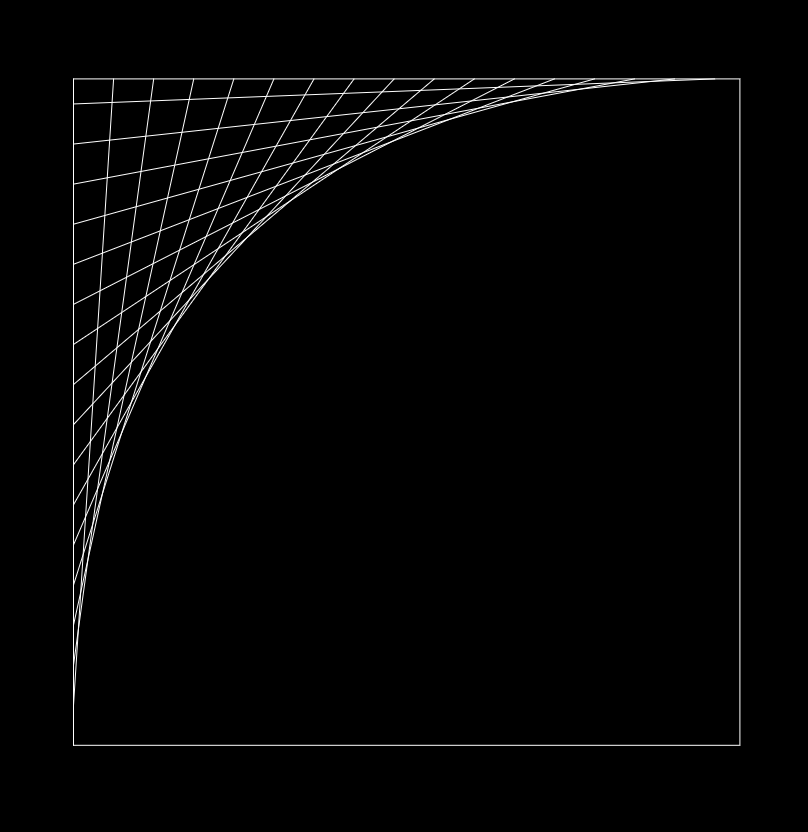
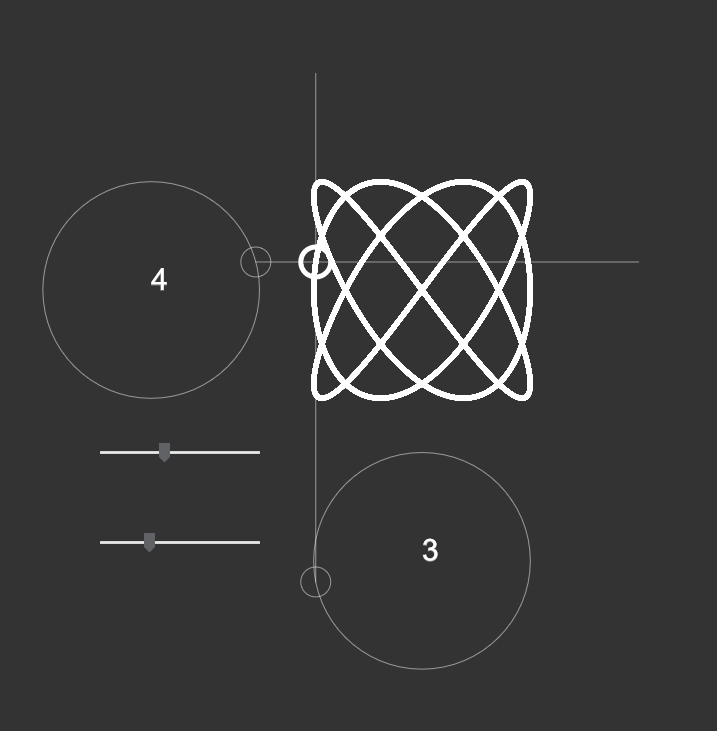
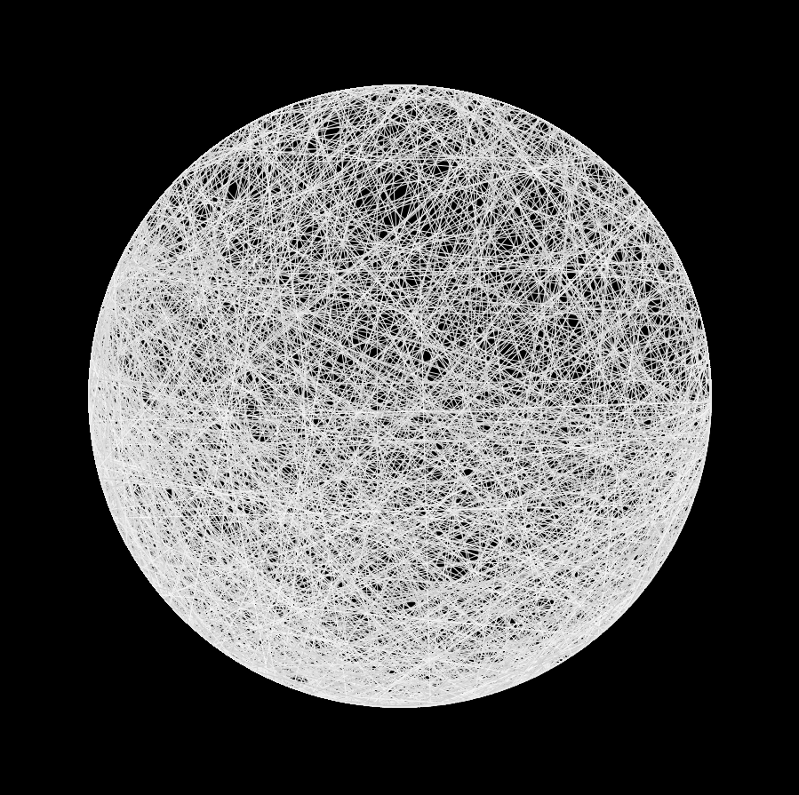

<head>
  
<link rel="stylesheet" href="https://www.w3schools.com/w3css/4/w3.css">
<link rel="stylesheet" href="https://fonts.googleapis.com/css?family=Karma">

  </head>

<body>

<!-- main content -->
<h4> By Joel Hurst.</h4>

All of my sketches are written in Processing then <strong>pain</strong>stakingly(2d arrays) adapted into p5.js! :) (almost all sketches are animated but obvs not on these images).

<!-- first row -->

  

    

      <a href="https://venomswitch.github.io/sketchbook/pointsArc">
        
      <h3>Angle</h3></a>
      
I used to draw these in primary school so thought it would be interesting to recreate it in Processing. Density of lines determined by mouseX, infinitely easier than drawing each line with a ruler...

    

    

      <a href="https://venomswitch.github.io/sketchbook/fractalTree/">
        
      <h3>Fractal tree</h3></a>
      
Basic fractal tree with 4 branches at equal angles per iteration.

    

    

      <a href="https://venomswitch.github.io/sketchbook/parametricP5/">
        
      <h3>Parametric equations</h3></a>
      
Parametric equations made basic here for purpose of reliability. Can be a bit mental with random values/colours.

    

    

      <a href="https://venomswitch.github.io/sketchbook/swirlingRectp5">
        
      <h3>Swirling rectangles</h3></a>
      
Made by mistake, ended up with this cool pattern.

    

  

<!-- second row -->

  

    

      <a href="https://venomswitch.github.io/sketchbook/basicLissajous/">
        
      <h3>Lissajous</h3></a>
      
A basic program (with sliders) which allows experimentation with different sine/cosine speeds to produce lissajous patterns.

    

    

      <a href="https://venomswitch.github.io/sketchbook/randomMoonCraters/">
        
      <h3>Moon craters</h3></a>
      
generate a circle filled with lines conforming to a random start and end along the circumference of the cirlce

    

</body>
